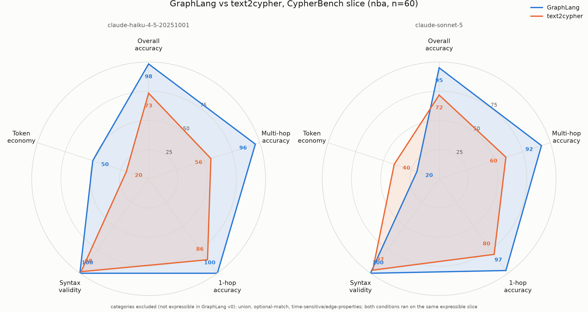

# Benchmarks

## Headline

On CypherBench multi-hop questions, theorem with the small Haiku 4.5 model reaches **96%** execution accuracy where text2cypher with the same model reaches **56%**. The language switch moves both tested models 20+ points overall; model scaling moves text2cypher approximately nothing.



## Setup

- **Dataset**: CypherBench NBA slice, 60 questions stratified over the expressible categories (no union, optional-match, or edge-property questions; those are [roadmap items](https://github.com/VishiATChoudhary/theorem/blob/main/ROADMAP.md)).
- **Conditions**: both ran on the identical slice with one repair retry each. text2cypher executed live on Neo4j; theorem executed on its own engine over the same graph loaded from CypherBench JSON.
- **Metric**: execution accuracy against CypherBench gold answers (set comparison, order-insensitive except explicit order-by questions).

## Results

| Condition | Overall EX | Multi-hop | 1-hop | Syntax valid | Mean result tokens |
|-----------|-----------:|----------:|------:|-------------:|-------------------:|
| theorem + Haiku 4.5 | **98.3%** | **96.0%** | **100%** | 100% | 245 |
| text2cypher + Haiku 4.5 | 73.3% | 56.0% | 85.7% | 98.3% | 394 |
| theorem + Sonnet 5 | **95.0%** | **92.0%** | 97.1% | 100% | 278 |
| text2cypher + Sonnet 5 | 71.7% | 60.0% | 80.0% | 96.7% | 207 |

Published frontier baselines for context: Claude 3.5 Sonnet 61.6% EX, GPT-4o 60.2% (CypherBench, arXiv 2412.18702). Two model generations later, Claude Opus 4.8 and GPT-5.5 still sit at 51-58% Cypher EX with 19-44% on hard queries (Text2GraphQuery-Bench, arXiv 2602.11745).

## What the eval fed back into the language

Three language changes came out of the eval loop, each documented in the spec: global aggregates, trail semantics, and the `compute` verb. The benchmark is not just a scoreboard; it is the language's test suite.

## Reproduce

```bash
uv run python -m eval.run_eval --n 60   # needs the claude CLI; docker for the Neo4j baseline
uv run python -m eval.spider
```

Per-question results, prompts, and the harness live in [`eval/`](https://github.com/VishiATChoudhary/theorem/tree/main/eval). New model runs are welcome as [benchmark result issues](https://github.com/VishiATChoudhary/theorem/issues/new?template=benchmark_result.md).
