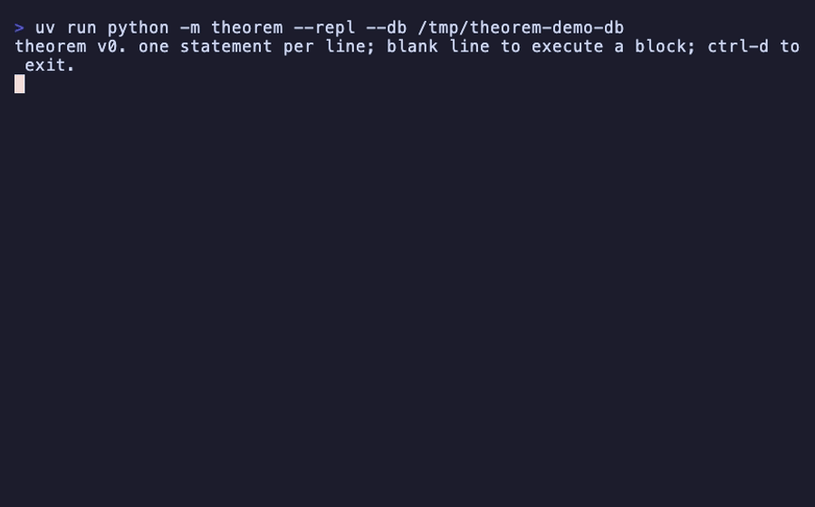

# theorem

**A graph language agents can't get wrong.** Every query is verified whole against the live schema before anything runs.

LLMs get roughly 40% of Cypher queries wrong on realistic schemas, and two years of model scaling have not moved that number. The failure modes are structural: reversed arrows, hallucinated labels, implicit grouping, long-range brackets. theorem removes each failure mode by construction. On the full public CypherBench test set, all 2,348 questions, the small Haiku model writing theorem reaches **78.0%** execution accuracy where the same model writing Cypher reaches **70.4%**, ahead on all seven graphs.



## Install

```bash
pip install theorem
```

```bash
theorem program.thm --db ./db    # run a program
theorem --repl                   # interactive session
```

## The shape of the language

```
find product where launch_year > 2024 as recent
follow recent uses component as parts
follow parts supplied_by source as sups
group by sups as g
count distinct g.parts as n_parts
return sups.name, n_parts order by n_parts desc budget 2000 tokens
```

One line, one step, one name. There is exactly one way to write each operation, so correct agents produce byte-identical queries.

## Five design rules

1. **No direction glyphs.** Edges traverse by role name. A wrong role is a type error caught before execution, not a silently empty result.
2. **One line, one step, one name.** No chaining, no nesting, nothing to balance.
3. **Explicit staged aggregation.** Adding a return column can never change the grouping.
4. **Schema-closed vocabulary.** The whole program is verified against the live schema before anything runs. Errors name the line, suggest the fix, and confirm nothing executed.
5. **Token budgets.** Results are capped with explicit truncation and continuation handles.

Beyond reads, theorem has a write surface no existing query language has: `assert` with provenance, receipts carrying dedup candidates, `merge`/`distinct` resolution, `refine`/`compact` granularity verbs with full lineage, `retire`, `flag`, `derive class`, and queryable per-node health.

## Where to go next

- [Tutorial](tutorial.md): productive in ten minutes
- [Language spec](language-spec.md): full grammar and semantics
- [Benchmarks](benchmarks.md): numbers, method, reproduction
- [Why not Cypher?](why-not-cypher.md): the scaling counterargument in full
- [Contributing](https://github.com/VishiATChoudhary/theorem/blob/main/CONTRIBUTING.md): the language grows spec-first, and proposals are welcome
